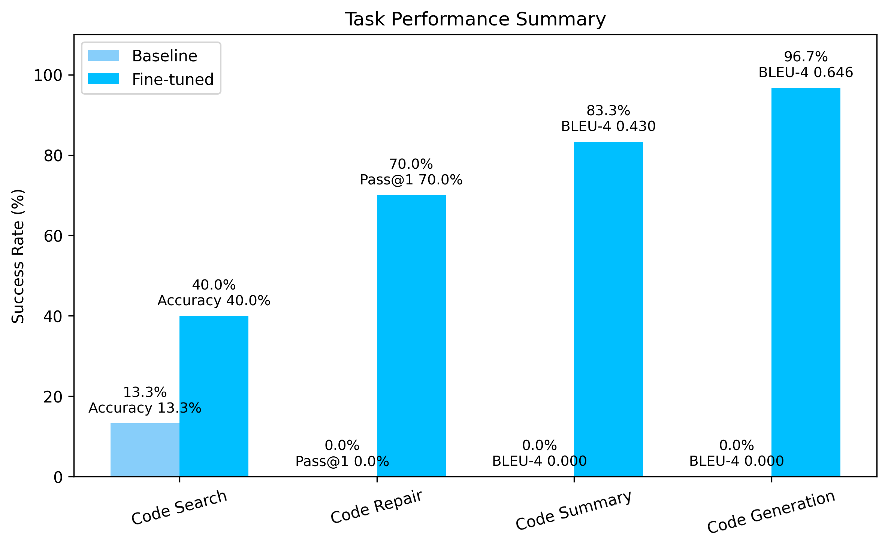

# codeLLM-DD Final Project

This repository contains the complete pipeline for **multi-task dataset construction, instruction tuning, and evaluation** of a code-oriented large language model.  

## Project Overview

The goal of this project is to investigate whether **multi-task instruction tuning** on a domain-specific dataset can significantly improve a base Code LLM’s ability to:

- Select correct code implementations from multiple candidates (**Code Search**)
- Detect and fix logical/structural bugs in code (**Code Repair**)
- Understand code semantics (**Code Summary**)
- Generate structured code from natural language descriptions (**Code Generation**)

We build a high-quality dataset from **shadcn/ui React patterns**, generate controlled buggy samples, and fine-tune **CodeT5+** using a multi-task instruction format.

## Dataset Summary

- **Source**: https://www.shadcn.io/patterns  
- **Original components collected**: 1,101  
- **Buggy samples generated**: 1,031  
- **Total data instances**: 2,132  

Each data item includes:
- Natural language description (`nl`)
- Complete React/TypeScript code (`pl`)
- Static structural tests (`tests`)
- Optional buggy version with a corresponding fixed version

The dataset is split as follows:
- **Training**: 1,916 samples  
- **Test**: 216 samples  

All component types (48 total) are evenly distributed across splits to prevent component-level bias.

## Training Setup

- **Base model**: CodeT5+ (Salesforce/codet5p)
- **Training method**: Multi-task instruction tuning
- **Hardware**: NVIDIA RTX A6000 GPU
- **Optimization strategy**:
  - Initial training with a high learning rate (5e-03)
  - Additional fine-tuning with a lower learning rate (2e-05)

The instruction format unifies multiple tasks under a single model, enabling shared representations across tasks.

## Task Performance Summary

The figure above summarizes the performance of the fine-tuned model across tasks and highlights the performance gains compared to the base model.  

## Repository Structure

### `data/`
- **Purpose**: Stores datasets used in this project.
- **Contents**:
  - Raw dataset collected from shadcn/ui patterns
  - Preprocessed multi-task datasets used for instruction tuning
- The raw data is converted into task-specific instruction formats during preprocessing.

### `fine_tuned_model/`
- **Purpose**: Stores outputs from the fine-tuning process.
- Includes model checkpoints, tokenizer files, and configuration artifacts generated during training.

### `output/`
- **Purpose**: Stores evaluation outputs.
- Includes prediction logs, metric summaries, and intermediate evaluation results.

### `build_dataset.py`
- **Purpose**: Dataset construction and preprocessing script.
- Converts raw component data into a multi-task instruction-tuning dataset, including buggy sample generation and static test creation.

### `instruction_tuning.py`
- **Purpose**: Main training and evaluation script.
- Performs multi-task instruction tuning and evaluates model performance on the test set.

### `make_graph.py`
- **Purpose**: Visualization utility.
- Generates plots and figures summarizing task-level performance (e.g., success rate comparisons).
